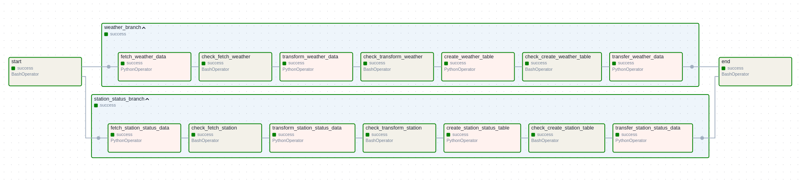

# Paris CityMapper ETL Pipeline 🗼

## Overview 🌟

This project implements an automated ETL (Extract, Transform, Load) pipeline using Apache Airflow to collect and process two main data sources:

- Weather data from OpenWeatherMap API 🌤️
- Velib (bike-sharing) station status from Velib Metropole API 🚲

The pipeline runs hourly to provide up-to-date information about weather conditions and bike availability in Paris.

## Architecture 🏗️

The project uses the following technologies:

- Apache Airflow 2.10.5 for workflow orchestration 🔄
- PostgreSQL for data storage 💾
- Amazon S3 for intermediate data storage ☁️
- Redis for Airflow's Celery Executor 🔧
- Docker and Docker Compose for containerization 🐳

## Project Structure 📁

```
citymapper_workflow_etl/
├── airflow/
│   ├── dags/
│   │   └── etl_dag.py       # Main DAG file
│   ├── plugins/
│   │   └── s3_to_postgres.py # Custom operator
│   ├── docker-compose.yaml   # Docker configuration
│   └── .env                  # Environment variables
```

## Data Pipeline 🔄

The DAG consists of two parallel branches:

### Weather Branch 🌤️

1. Fetch weather data from OpenWeatherMap API
2. Transform data into structured CSV format
3. Create weather table in PostgreSQL (if not exists)
4. Load data into PostgreSQL

### Station Status Branch 🚲

1. Fetch Velib station status from API
2. Transform data into structured CSV format
3. Create station status table in PostgreSQL (if not exists)
4. Load data into PostgreSQL

## Prerequisites 📋

- Docker and Docker Compose installed
- AWS credentials for S3 access
- OpenWeatherMap API key
- PostgreSQL connection details



## Airflow Configuration 🔐

### Variables

Set the following variables in the Airflow Admin Interface (Admin > Variables):

```
AWS_DEFAULT_REGION    # Your AWS region (e.g., eu-west-1)
OPENWEATHERMAP_API    # Your OpenWeatherMap API key
S3BucketName          # Your S3 bucket name
```

### Connections

Configure the following connections in Airflow (Admin > Connections):

1. AWS Connection (`aws_citymapper`):

   - Conn Type: Amazon Web Services
   - Configure with your AWS credentials

2. PostgreSQL Connection (`postgres_citymapper`):
   - Conn Type: Postgres
   - Configure with your database credentials

## Installation & Setup 🚀

1. Clone the repository:

```bash
git clone <repository-url>
cd citymapper_workflow_etl
```

2. Start the Airflow services:

```bash
cd airflow
docker compose up airflow-init
docker-compose up --build
```

4. Access Airflow web interface:

```
http://localhost:8080
Username: airflow
Password: airflow
```

## DAG Structure 📊

```
start
  ├── weather_branch
  │   ├── fetch_weather_data
  │   ├── transform_weather_data
  │   ├── create_weather_table
  │   └── transfer_weather_data
  │
  ├── station_status_branch
  │   ├── fetch_station_status_data
  │   ├── transform_station_status_data
  │   ├── create_station_status_table
  │   └── transfer_station_status_data
  │
  └── end
```

## Monitoring 📈

- Access the Airflow web interface to monitor DAG runs
- Check task logs for detailed execution information
- Monitor PostgreSQL database for data consistency
- Check S3 bucket for intermediate data files

## Contributing 🤝

Feel free to submit issues and enhancement requests!

## License 📜

This project is licensed under the Apache License 2.0 - see the LICENSE file for details.
